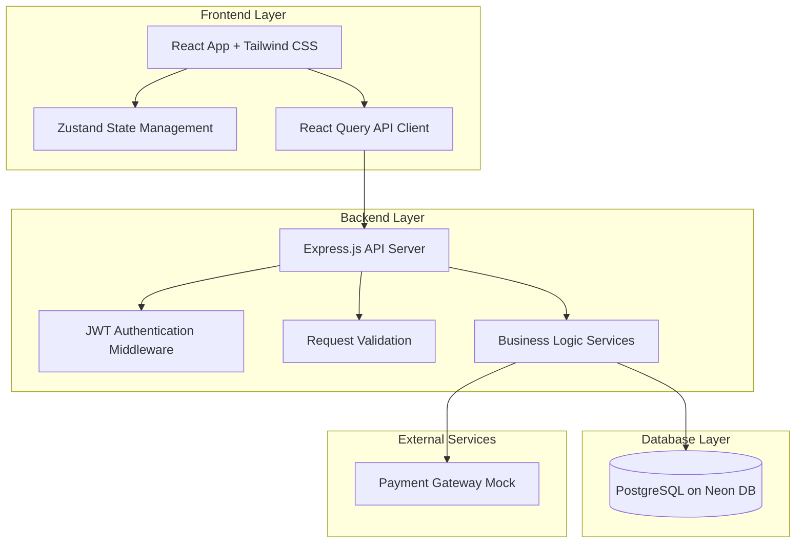

# Design Document

## Overview

The KIXX e-commerce platform Phase 1 MVP is architected as a modular monolith with clear separation between frontend, backend, and database layers. This design prioritizes rapid development, easier debugging, and future scalability. The system implements core e-commerce workflows including user authentication, product browsing, cart management, checkout, and order processing.

## Architecture

### High-Level Architecture



### Technology Stack

- **Frontend**: React.js 18+, Tailwind CSS 3+, Zustand for state management, React Query for API communication
- **Backend**: Node.js 18+, Express.js 4+, JWT for authentication, express-validator for request validation
- **Database**: PostgreSQL 15+ hosted on Neon DB, Sequelize ORM for data modeling
- **Development Tools**: Vite for frontend bundling, nodemon for backend hot-reload

### Design Decisions

1. **Modular Monolith over Microservices**: Chosen for Phase 1 to reduce operational complexity, enable faster development cycles, and simplify debugging. The codebase is organized into logical modules (auth, products, orders) that can be extracted into microservices in future phases.

2. **Zustand over Redux**: Selected for simpler API, less boilerplate, and better TypeScript support while maintaining predictable state management.

3. **React Query for API Layer**: Provides automatic caching, background refetching, and optimistic updates out of the box, reducing custom API client code.

4. **Sequelize ORM**: Offers database abstraction, migration management, and relationship handling while maintaining flexibility for raw SQL when needed.

5. **JWT Authentication**: Stateless authentication approach that scales horizontally and simplifies backend architecture without session storage requirements.

## Components and Interfaces

### Backend Components

#### 1. Authentication Service

**Responsibilities:**
- User registration with password hashing
- User login with JWT token generation
- Token validation and user extraction

**Interface:**
```javascript
class AuthService {
  async register(email, password, name) 
    // Returns: { user, token }
  
  async login(email, password)
    // Returns: { user, token }
  
  async verifyToken(token)
    // Returns: { userId, email, role }
}
```

#### 2. Product Service

**Responsibilities:**
- Product catalog retrieval with filtering
- Product detail retrieval with variants
- Brand management

**Interface:**
```javascript
class ProductService {
  async getAllProducts(filters = {})
    // Filters: { brandId, category }
    // Returns: [{ id, name, brand, basePrice, category }]
  
  async getProductById(productId)
    // Returns: { id, name, description, brand, variants: [] }
  
  async getProductVariants(productId)
    // Returns: [{ id, size, color, stock, sku, price }]
}
```

#### 3. Order Service

**Responsibilities:**
- Order creation from cart items
- Order status management
- Order history retrieval

**Interface:**
```javascript
class OrderService {
  async createOrder(userId, cartItems)
    // cartItems: [{ variantId, quantity }]
    // Returns: { orderId, totalPrice, status }
  
  async processPayment(orderId, paymentDetails)
    // Returns: { success, paymentId, updatedStatus }
  
  async getUserOrders(userId)
    // Returns: [{ id, totalPrice, status, createdAt, items: [] }]
  
  async getOrderById(orderId, userId)
    // Returns: { id, totalPrice, status, items: [], createdAt }
}
```

#### 4. Cart Service (Frontend)

**Responsibilities:**
- Cart state management in Zustand store
- Cart item validation against stock
- Total price calculation

**Interface:**
```javascript
// Zustand Store
const useCartStore = create((set, get) => ({
  items: [],
  
  addItem: (variant, quantity) => {},
  updateQuantity: (variantId, quantity) => {},
  removeItem: (variantId) => {},
  clearCart: () => {},
  getTotalPrice: () => {},
  getItemCount: () => {}
}))
```

### API Endpoints

#### Authentication Routes

```
POST /api/auth/register
Body: { email, password, name }
Response: { user: { id, email, name, role }, token }

POST /api/auth/login
Body: { email, password }
Response: { user: { id, email, name, role }, token }
```

#### Product Routes

```
GET /api/products
Query: ?brandId=uuid&category=string
Response: { products: [{ id, name, brand, basePrice, category, imageUrl }] }

GET /api/products/:id
Response: { 
  id, name, description, basePrice, category,
  brand: { id, name, logoUrl },
  variants: [{ id, size, color, stock, sku }]
}
```

#### Order Routes

```
POST /api/orders
Headers: Authorization: Bearer <token>
Body: { items: [{ variantId, quantity }] }
Response: { orderId, totalPrice, status, createdAt }

POST /api/orders/:id/payment
Headers: Authorization: Bearer <token>
Body: { paymentMethod, paymentDetails }
Response: { success, paymentId, orderStatus }

GET /api/orders/user/:userId
Headers: Authorization: Bearer <token>
Response: { orders: [{ id, totalPrice, status, createdAt, itemCount }] }

GET /api/orders/:id
Headers: Authorization: Bearer <token>
Response: { 
  id, totalPrice, status, createdAt,
  items: [{ variant, quantity, price }]
}
```

### Frontend Components

#### Page Components

1. **LoginPage / RegisterPage**: Authentication forms with validation
2. **HomePage**: Product catalog grid with filters
3. **ProductDetailPage**: Product information with variant selector
4. **CartPage**: Cart items list with quantity controls
5. **CheckoutPage**: Order summary and payment form
6. **OrderHistoryPage**: User's past orders
7. **OrderDetailPage**: Detailed view of single order

#### Shared Components

1. **Navbar**: Navigation with cart icon and user menu
2. **ProductCard**: Product display in grid with image, name, price
3. **VariantSelector**: Size and color selection dropdowns
4. **CartItem**: Single cart item with quantity controls
5. **ProtectedRoute**: Route wrapper requiring authentication

## Data Models

### Database Schema (Sequelize Models)

#### Users Table
```javascript
{
  id: UUID (PK, default: uuid_generate_v4()),
  name: VARCHAR(255) NOT NULL,
  email: VARCHAR(255) UNIQUE NOT NULL,
  passwordHash: VARCHAR(255) NOT NULL,
  role: ENUM('user', 'admin') DEFAULT 'user',
  createdAt: TIMESTAMP DEFAULT NOW(),
  updatedAt: TIMESTAMP DEFAULT NOW()
}
```

#### Brands Table
```javascript
{
  id: UUID (PK, default: uuid_generate_v4()),
  name: VARCHAR(255) NOT NULL,
  logoUrl: VARCHAR(500),
  createdAt: TIMESTAMP DEFAULT NOW(),
  updatedAt: TIMESTAMP DEFAULT NOW()
}
```

#### Products Table
```javascript
{
  id: UUID (PK, default: uuid_generate_v4()),
  brandId: UUID (FK -> Brands.id) NOT NULL,
  name: VARCHAR(255) NOT NULL,
  description: TEXT,
  basePrice: DECIMAL(10,2) NOT NULL,
  category: VARCHAR(100) NOT NULL,
  imageUrl: VARCHAR(500),
  createdAt: TIMESTAMP DEFAULT NOW(),
  updatedAt: TIMESTAMP DEFAULT NOW()
}
```

#### Product_Variants Table
```javascript
{
  id: UUID (PK, default: uuid_generate_v4()),
  productId: UUID (FK -> Products.id) NOT NULL,
  size: VARCHAR(10) NOT NULL,
  color: VARCHAR(50) NOT NULL,
  stock: INTEGER NOT NULL DEFAULT 0,
  sku: VARCHAR(100) UNIQUE NOT NULL,
  createdAt: TIMESTAMP DEFAULT NOW(),
  updatedAt: TIMESTAMP DEFAULT NOW()
}
```

#### Orders Table
```javascript
{
  id: UUID (PK, default: uuid_generate_v4()),
  userId: UUID (FK -> Users.id) NOT NULL,
  totalPrice: DECIMAL(10,2) NOT NULL,
  status: ENUM('pending', 'paid', 'shipped', 'delivered', 'cancelled') DEFAULT 'pending',
  paymentId: VARCHAR(255),
  createdAt: TIMESTAMP DEFAULT NOW(),
  updatedAt: TIMESTAMP DEFAULT NOW()
}
```

#### Order_Items Table
```javascript
{
  id: UUID (PK, default: uuid_generate_v4()),
  orderId: UUID (FK -> Orders.id) NOT NULL,
  variantId: UUID (FK -> Product_Variants.id) NOT NULL,
  quantity: INTEGER NOT NULL,
  price: DECIMAL(10,2) NOT NULL,
  createdAt: TIMESTAMP DEFAULT NOW(),
  updatedAt: TIMESTAMP DEFAULT NOW()
}
```

### Future-Proofing Tables (Schema Only)

#### Resale_Listings Table
```javascript
{
  id: UUID (PK, default: uuid_generate_v4()),
  sellerId: UUID (FK -> Users.id) NOT NULL,
  productId: UUID (FK -> Products.id) NOT NULL,
  condition: ENUM('new', 'like_new', 'good', 'fair') NOT NULL,
  price: DECIMAL(10,2) NOT NULL,
  status: ENUM('active', 'sold', 'removed') DEFAULT 'active',
  verified: BOOLEAN DEFAULT false,
  createdAt: TIMESTAMP DEFAULT NOW(),
  updatedAt: TIMESTAMP DEFAULT NOW()
}
```

#### Recommendations_Log Table
```javascript
{
  id: UUID (PK, default: uuid_generate_v4()),
  userId: UUID (FK -> Users.id) NOT NULL,
  productId: UUID (FK -> Products.id) NOT NULL,
  score: DECIMAL(5,2) NOT NULL,
  createdAt: TIMESTAMP DEFAULT NOW()
}
```

#### Pricing_Rules Table
```javascript
{
  id: UUID (PK, default: uuid_generate_v4()),
  productId: UUID (FK -> Products.id) NOT NULL,
  demandScore: DECIMAL(5,2) NOT NULL,
  dynamicPrice: DECIMAL(10,2) NOT NULL,
  updatedAt: TIMESTAMP DEFAULT NOW()
}
```

### Sequelize Relationships

```javascript
// User relationships
User.hasMany(Order, { foreignKey: 'userId' })
Order.belongsTo(User, { foreignKey: 'userId' })

// Brand relationships
Brand.hasMany(Product, { foreignKey: 'brandId' })
Product.belongsTo(Brand, { foreignKey: 'brandId' })

// Product relationships
Product.hasMany(ProductVariant, { foreignKey: 'productId' })
ProductVariant.belongsTo(Product, { foreignKey: 'productId' })

// Order relationships
Order.hasMany(OrderItem, { foreignKey: 'orderId' })
OrderItem.belongsTo(Order, { foreignKey: 'orderId' })
OrderItem.belongsTo(ProductVariant, { foreignKey: 'variantId' })
```

## Error Handling

### Backend Error Strategy

1. **Validation Errors (400)**: Use express-validator to validate request bodies and return structured error messages
2. **Authentication Errors (401)**: Return when JWT is missing, invalid, or expired
3. **Authorization Errors (403)**: Return when user lacks permission for resource
4. **Not Found Errors (404)**: Return when requested resource doesn't exist
5. **Server Errors (500)**: Catch unexpected errors and return generic message while logging details

**Error Response Format:**
```javascript
{
  error: {
    code: "VALIDATION_ERROR",
    message: "Invalid request data",
    details: [
      { field: "email", message: "Invalid email format" }
    ]
  }
}
```

### Frontend Error Handling

1. **React Query Error Boundaries**: Catch API errors and display user-friendly messages
2. **Form Validation**: Client-side validation before API calls using react-hook-form
3. **Toast Notifications**: Display success/error messages for user actions
4. **Retry Logic**: Automatic retry for failed requests with exponential backoff

## Testing Strategy

### Backend Testing

1. **Unit Tests**: Test individual service methods with mocked dependencies
   - AuthService: registration, login, token validation
   - ProductService: filtering, variant retrieval
   - OrderService: order creation, payment processing

2. **Integration Tests**: Test API endpoints with test database
   - Authentication flow: register → login → protected route access
   - Product flow: list products → get product details
   - Order flow: create order → process payment → retrieve order

3. **Database Tests**: Test Sequelize models and relationships
   - Model validations and constraints
   - Foreign key relationships
   - Cascade delete behavior

### Frontend Testing

1. **Component Tests**: Test individual React components with React Testing Library
   - Form components: validation, submission
   - Product components: variant selection, add to cart
   - Cart components: quantity updates, item removal

2. **Integration Tests**: Test user flows with mocked API
   - Authentication flow: register → login → redirect
   - Shopping flow: browse → select variant → add to cart → checkout
   - Order flow: checkout → payment → order confirmation

3. **E2E Tests**: Test critical paths with Playwright (optional for Phase 1)
   - Complete purchase flow from landing to order confirmation

### Testing Tools

- **Backend**: Jest, Supertest for API testing
- **Frontend**: Vitest, React Testing Library
- **Database**: Separate test database on Neon DB or local PostgreSQL

## Security Considerations

1. **Password Security**: Use bcrypt with cost factor 10 for password hashing
2. **JWT Security**: Use strong secret key, set reasonable expiration (24 hours), include user role in payload
3. **Input Validation**: Validate all user inputs on backend using express-validator
4. **SQL Injection Prevention**: Use Sequelize parameterized queries exclusively
5. **CORS Configuration**: Restrict allowed origins to frontend domain
6. **Rate Limiting**: Implement rate limiting on authentication endpoints to prevent brute force
7. **Environment Variables**: Store sensitive configuration (DB credentials, JWT secret) in .env files

## Performance Considerations

1. **Database Indexing**: Add indexes on frequently queried columns (email, sku, userId, productId)
2. **Query Optimization**: Use Sequelize eager loading to prevent N+1 queries
3. **Frontend Caching**: Leverage React Query caching for product catalog
4. **Image Optimization**: Use CDN for product images with lazy loading
5. **Pagination**: Implement pagination for product listings (future enhancement)

## Deployment Architecture (Phase 1)

1. **Frontend**: Deploy to Vercel or Netlify with automatic builds from Git
2. **Backend**: Deploy to Railway, Render, or Heroku with environment variables
3. **Database**: Neon DB managed PostgreSQL with connection pooling
4. **Environment Separation**: Separate development and production environments with different database instances
